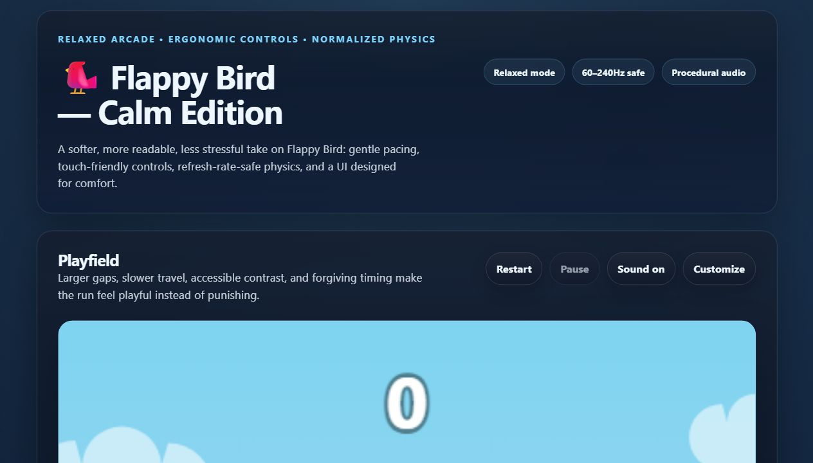

# Flappy Bird — Calm Edition

[](LICENSE.txt)
[](game.js)
[](package.json)
[](README.md#accessibility)

**A polished, friendly, browser-first Flappy Bird built for flow instead of frustration.**

Calm Edition keeps the instant arcade loop people love, then smooths the rough edges:
gentler physics, readable timing, cozy themes, procedural audio, accessibility, stats,
achievements, and a one-hit Feather Shield. No build step. No external assets. Just open
the game and glide.

[](https://0thernes.github.io/flappy-bird-calm-edition/)

[Play the live demo](https://0thernes.github.io/flappy-bird-calm-edition/) ·
[Run locally](#quick-start) ·
[Features](#features) ·
[Contribute](#contributing)

## Why It Feels Better

| Design Goal            | What Calm Edition Does                                                                         |
| ---------------------- | ---------------------------------------------------------------------------------------------- |
| Softer difficulty      | Larger pipe gaps, slower travel, gentler gravity, and slower terminal fall speed.              |
| More player expression | Hold `Shift` to brake, hold `Arrow Down` to dive, and tune physics in the Zen Customizer.      |
| More delight           | Themes, particle bursts, procedural music, expressive bird emotions, and cozy achievements.    |
| Less punishment        | Feather Shield absorbs one collision and gives the bird a graceful recovery moment.            |
| Better reliability     | Refresh-rate-independent physics stays consistent across 60Hz, 144Hz, and 240Hz displays.      |
| Better inclusion       | Keyboard support, ARIA live updates, reduced motion, and high-contrast awareness are built in. |

## Features

- **Calm physics presets** — Tune gravity and speed from gentle to lively.
- **Zen Customizer** — Adjust physics, music volume, sound volume, and visual theme.
- **Four themes** — Sunset, Midnight, Cozy Rain, and Aurora each change colors, weather, and music.
- **Feather Shield** — A collectible bubble that absorbs one crash and grants brief invincibility.
- **Expressive bird** — The bird reacts with calm, happy, scared, determined, and dizzy states.
- **Eye tracking** — Pupils track the nearest safe gap for a lively, readable character.
- **Procedural audio** — Web Audio creates every flap, chime, shield sound, and music note.
- **Stats and achievements** — Track zen minutes, shields saved, runs completed, and near misses.
- **Zero dependencies** — Pure HTML, CSS, and JavaScript. No bundler, package install, CDN, or assets.

## Quick Start

### Play In A Browser

Open `index.html` directly, or use a tiny local server:

```bash
python -m http.server 8000
```

Then visit `http://localhost:8000`.

### Check The Project

```bash
npm run check
```

The check runs JavaScript syntax validation plus a smoke test for the core repo promises:
canvas, accessibility hooks, customizer, storage helpers, and security-sensitive ignore rules.

## Controls

| Input                 | Action            |
| --------------------- | ----------------- |
| `Space` or `Arrow Up` | Feather flap      |
| `Click` or `Tap`      | Tap-friendly flap |
| Hold `Shift`          | Soften descent    |
| Hold `Arrow Down`     | Controlled dive   |
| `Escape`              | Pause or resume   |
| `M`                   | Mute or unmute    |
| `R`                   | Fresh restart     |

## Accessibility

Calm Edition treats accessibility as part of the game design, not a side quest.

- Fully keyboard-playable controls.
- Screen-reader status updates through an ARIA live region.
- `prefers-reduced-motion` support for motion, particles, trails, shake, and weather density.
- High-contrast media query support.
- Modal-style customizer drawer with focus management and inert background behavior.

## Engineering Notes

| Area         | Approach                                                                          |
| ------------ | --------------------------------------------------------------------------------- |
| Rendering    | Canvas 2D game world with DOM UI chrome for accessible controls.                  |
| Audio        | Web Audio oscillators, scheduled on the AudioContext clock for stable timing.     |
| Physics      | Normalized delta time, capped lag spikes, semi-implicit Euler integration.        |
| Performance  | Pre-allocated particle and weather pools avoid gameplay allocation churn.         |
| Persistence  | Guarded `localStorage` helpers for best score, settings, stats, and achievements. |
| Distribution | Static files only. The game works from disk, localhost, or GitHub Pages.          |

## Repository Map

| Path                      | Purpose                                                                                    |
| ------------------------- | ------------------------------------------------------------------------------------------ |
| `index.html`              | Semantic page shell, controls, canvas, customizer drawer, and ARIA regions.                |
| `style.css`               | Responsive dark UI, panels, controls, customizer, themes, and accessibility media queries. |
| `game.js`                 | Game engine: physics, rendering, audio, input, persistence, stats, and achievements.       |
| `tests/smoke-test.mjs`    | Lightweight repo smoke checks.                                                             |
| `docs/assets/`            | README and repository presentation assets.                                                 |
| `.github/ISSUE_TEMPLATE/` | Friendly issue forms for bugs, ideas, and accessibility feedback.                          |
| `.memory/`                | Project context notes for future maintainers and AI assistants.                            |
| `LICENSE.txt`             | AGPL-3.0-or-later license text.                                                            |

## Contributing

Contributions are welcome when they keep the game calm, accessible, dependency-free, and easy
to run. Start with [CONTRIBUTING.md](CONTRIBUTING.md), then use the issue templates for bugs,
feature ideas, or accessibility feedback.

Good first areas:

- Theme polish and seasonal palettes.
- Accessibility testing across browsers and assistive tech.
- Documentation improvements.
- Tiny quality-of-life improvements that preserve the no-build-step setup.

## Support

Need help running the game or reporting a problem? See [SUPPORT.md](SUPPORT.md).

## License

AGPL-3.0-or-later. See [LICENSE.txt](LICENSE.txt).

If you run a modified version on a public server, offer users the matching source code.

---

Built for players who want the joy of Flappy Bird with a little more grace in the wings.
